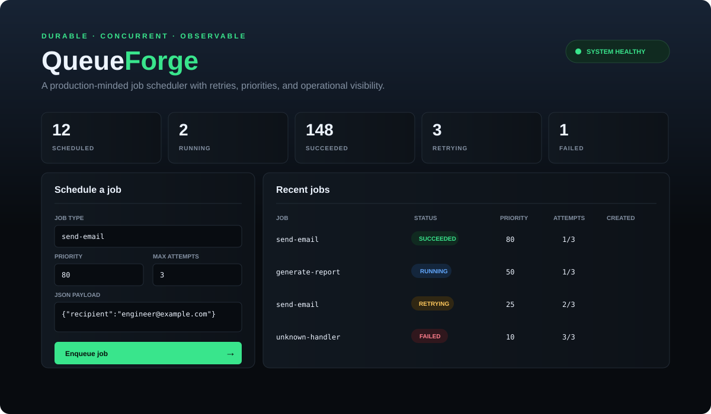
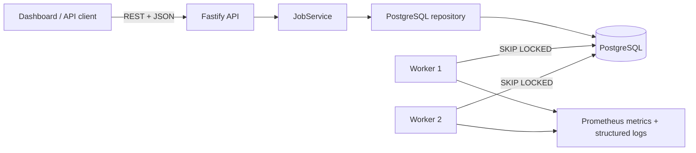

# QueueForge

> A durable, observable job scheduler that safely coordinates concurrent workers, retries transient failures, and exposes its operational state.

[](https://github.com/pharzy1/queueforge/actions/workflows/ci.yml)
[](https://www.typescriptlang.org/)
[](LICENSE)

QueueForge is a portfolio-grade backend system, not a task-list demo. It shows how to prevent two workers from processing the same job, how to recover from transient failures, and how to make asynchronous systems observable.



## Engineering highlights

- **Concurrency-safe claims:** PostgreSQL row locks and `FOR UPDATE SKIP LOCKED` distribute work without a central coordinator.
- **Failure recovery:** bounded exponential backoff retries transient failures; exhausted jobs enter a terminal failed state.
- **Worker leases:** abandoned running jobs become claimable after a bounded lease, preventing crashed workers from leaving work stuck forever.
- **Relational design:** constraints encode invariants, JSONB supports flexible payloads, and a partial composite index accelerates the hot claim query.
- **Typed boundaries:** strict TypeScript domain models plus Zod validation protect the API boundary.
- **Operational visibility:** structured logs, health checks, queue statistics, and Prometheus-compatible metrics.
- **Production delivery:** multi-stage Docker build, Docker Compose development environment, least-privilege runtime user, and GitHub Actions quality gates.
- **Testable architecture:** dependency inversion allows deterministic unit and API tests without a database.

## Architecture



The API and workers share a repository contract but are separate processes. Workers atomically claim the highest-priority runnable job. This favors horizontal scalability and operational simplicity over adding a separate message broker. See [the architecture decision record](docs/adr/001-postgres-queue.md).

## Run locally

Prerequisites: Docker Desktop and Docker Compose.

```bash
git clone https://github.com/pharzy1/queueforge.git
cd queueforge
docker compose up --build
```

Open [http://localhost:3000](http://localhost:3000). Schedule `send-email` or `generate-report`; the worker will process it and the dashboard refreshes automatically.

```bash
curl -X POST http://localhost:3000/api/jobs \
  -H 'content-type: application/json' \
  -d '{"name":"send-email","payload":{"recipient":"you@example.com"},"priority":80,"maxAttempts":3}'
```

Useful endpoints:

| Method | Path | Purpose |
|---|---|---|
| `POST` | `/api/jobs` | Validate and schedule work |
| `GET` | `/api/jobs` | List recent jobs |
| `GET` | `/api/jobs/:id` | Inspect a job |
| `DELETE` | `/api/jobs/:id` | Cancel pending work |
| `GET` | `/api/stats` | Status counts for the dashboard |
| `GET` | `/health` | Liveness check |
| `GET` | `/metrics` | Prometheus exposition |

## Development

```bash
cp .env.example .env
pnpm install
pnpm check       # lint, strict type-check, tests with coverage, build
pnpm dev         # API with reload
pnpm worker      # worker with reload, in another terminal
```

The main test cases cover priority ordering, retry transitions, exhausted attempts, request validation, resource creation, and not-found behavior. CI repeats every quality check and verifies the production container builds.

For repeatable load testing, see [the benchmark methodology](docs/BENCHMARKING.md). The repository intentionally does not claim throughput until a controlled deployment has produced raw, reproducible results.

## Trade-offs and next steps

PostgreSQL is a deliberate fit for moderate throughput and teams that want transactional guarantees without operating Kafka or Redis. At sustained high throughput, the polling and table churn become limiting; the next step would be partitioning/archive policies or moving dispatch to a dedicated broker while keeping PostgreSQL as the system of record.

Planned extensions are authenticated multi-tenancy, cron schedules, worker heartbeats for reclaiming abandoned locks, OpenTelemetry traces, and an end-to-end test against ephemeral PostgreSQL.

## Résumé-ready summary

> Built a concurrent TypeScript job scheduler using Fastify and PostgreSQL, implementing priority queues, atomic worker claims, bounded exponential-backoff retries, Prometheus metrics, automated tests, Docker packaging, and CI quality gates.

Do not claim production scale or measured performance until you run the benchmark and record real results. The [portfolio checklist](docs/PORTFOLIO.md) explains how to publish this honestly and turn it into stronger evidence.

## License

[MIT](LICENSE)
